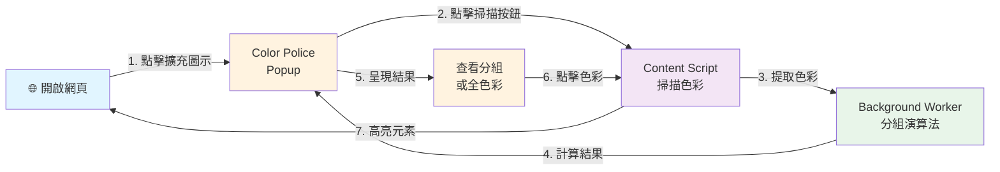
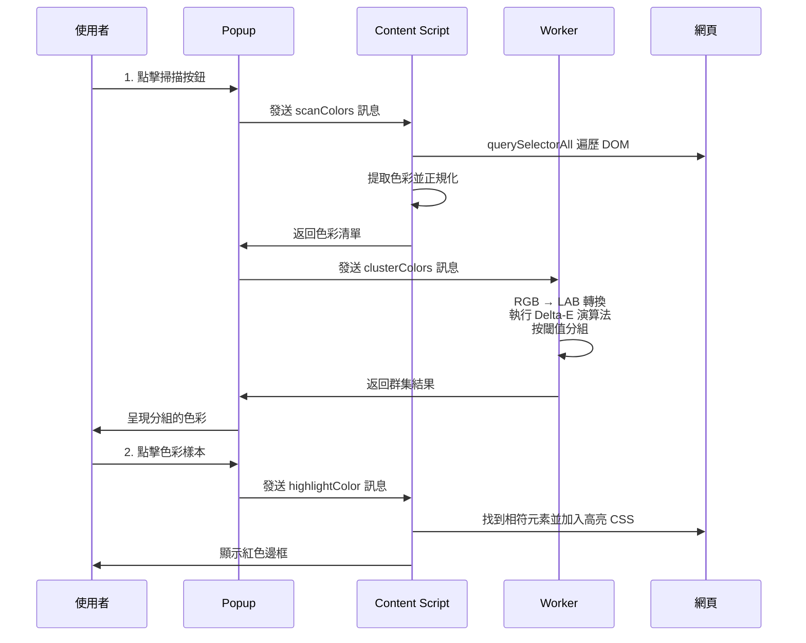
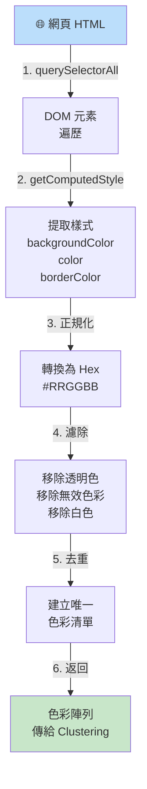

# Color Thief Police

🎨 一個 Chrome 擴充功能，掃描網頁中的所有色彩，使用 Delta-E (CIEDE2000) 群集演算法將相似色彩分組，並高亮顯示以檢測設計系統不一致。

## 快速連結

- 📖 [完整文件](./PLANNING.md) - 架構、設計決策、路線圖
- 🐛 [回報問題](https://github.com/eden0118/color-police/issues)
- ⭐ [在 GitHub 上給星星](https://github.com/eden0118/color-police)

---

## 功能

✅ **自動色彩提取** - 掃描可見 DOM 元素（背景、文字、邊框）

✅ **智能群集** - 使用感知準確的 CIEDE2000 演算法對相似色彩分組

✅ **互動式高亮** - 點擊色彩以高亮顯示頁面上的相符元素

✅ **可調整閾值** - 控制分組嚴格程度（5-100 範圍，預設 30）

✅ **暗色模式** - 內建暗色主題，具持久化儲存

✅ **多語言支援** - 支援英文和繁體中文

✅ **快速效能** - 大多數頁面掃描 <2 秒

---

## 工作流程圖



---

## 安裝

### 前置要求
- Google Chrome 88+ 或基於 Chromium 的瀏覽器
- Node.js 16+ 和 npm（用於開發）

### 安裝步驟

1. **複製或下載**此儲存庫
   ```bash
   git clone https://github.com/eden0118/color-police.git
   cd color-police
   ```

2. **安裝依賴項**
   ```bash
   npm install
   ```

3. **構建擴充功能**
   ```bash
   npm run build
   ```

4. **在 Chrome 中載入**
   - 開啟 `chrome://extensions/`
   - 啟用「開發者模式」（右上角的切換開關）
   - 點擊「載入解包項目」
   - 選擇此專案中的 `dist/` 資料夾
   - 完成！點擊工具欄中的擴充圖示

---

## 使用方式

### 基本工作流程



1. **導覽**到任何網站
2. **點擊**工具欄中的 Color Thief Police 擴充圖示
3. **點擊「掃描頁面」**按鈕在 popup 中
4. **查看結果**在兩種模式中：
   - **群集標籤** - 感知相似的色彩分組在一起
   - **所有色彩標籤** - 檢測到的所有色彩完整清單
5. **點擊任何色彩**以高亮顯示頁面上的相符元素
   - 紅色動畫邊框出現在相符元素上
   - 再次點擊同一色彩以取消選擇
   - 高亮是非破壞性的（取消選擇時移除）
6. **調整閾值**滑塊以改變分組嚴格程度
   - 較低值 (5-20) = 更嚴格，更多群組
   - 較高值 (70-100) = 更寬鬆，較少群組
   - 預設值 (30) = 業界標準 (JND)

### 提示與技巧

- **閾值語義**:
  - 5-15：非常嚴格的審計（許多色彩群組）
  - 20-30：平衡（最有用）
  - 30：業界標準（剛好可察覺差異）
  - 40-60：寬鬆分組
  - 70-100：僅基本色彩系列

- **切換語言**：使用標題中的語言選擇器（英文 / 繁體中文）

- **切換暗色模式**：使用標題中的主題按鈕（跨會話持久化）

- **效能**：輕量級頁面 <100ms 掃描，大型頁面通常 <2s

---

## 開發

### 設置開發環境

```bash
# 安裝依賴項
npm install

# 啟動開發伺服器（具熱重載）
npm run dev
```

### 開發工作流程

1. **啟動 dev 伺服器**：`npm run dev`
2. **編輯** `src/` 資料夾中的檔案
3. **重新載入擴充功能**：
   - 前往 `chrome://extensions/`
   - 在 Color Thief Police 上點擊重新整理按鈕
   - 變更出現（popup 檔案使用 HMR 自動重新載入）

### 可用命令

```bash
npm run dev              # 啟動具熱重載的 dev 伺服器
npm run build           # 為生產環境構建（最小化）
npm run format          # 使用 Prettier 自動格式化程式碼
npm run format:check    # 檢查程式碼格式（無變更）
npm run watch           # 監視模式（檔案變更時重建）
npm run preview         # 預覽已構建的擴充功能
```

### 專案結構

```
src/
├── popup/
│   ├── App.jsx              # 主 React 元件，具 UI 邏輯
│   ├── main.jsx             # React 進入點
│   ├── index.html           # HTML 範本
│   └── popup.css            # Tailwind 樣式
│
├── content/
│   └── script.js            # Content script（DOM 色彩提取與高亮）
│
├── background/
│   └── worker.js            # Service worker（Delta-E 群集演算法）
│
├── utils/
│   ├── colorExtractor.js    # DOM 元素遍歷與色彩提取
│   ├── colorClustering.js   # CIEDE2000 演算法實現
│   └── colorContrast.js     # 文字色彩計算
│
└── i18n/
    └── translations.js      # 國際化字串（EN、ZH）

設定檔：
├── manifest.json            # Chrome Extension manifest v3
├── vite.config.js          # Vite 構建設定
├── tailwind.config.js      # Tailwind CSS 主題
├── postcss.config.js       # PostCSS 設定
├── .prettierrc              # Prettier 格式化規則
└── package.json            # 依賴項與指令碼
```

### 除錯

**除錯 Popup**:
```
1. 右鍵點擊擴充 popup
2. 選擇「檢查」
3. DevTools 為 popup 開啟（控制台、網路等）
```

**除錯 Content Script**:
```
1. 開啟擴充執行所在的頁面
2. 按 F12（DevTools）
3. 前往「Sources」標籤 → 「Content scripts」
4. 找到並除錯 script.js
```

**除錯 Background Worker**:
```
1. 前往 chrome://extensions/
2. 找到 Color Thief Police
3. 點擊「Service worker」連結以開啟 DevTools
```

### 程式碼品質

**格式化您的程式碼**:
```bash
npm run format              # 使用 Prettier 自動格式化
npm run format:check        # 檢查而不進行變更
```

**格式化設定**:
- 2 個空格縮排
- 字串使用單引號
- 100 字元行寬
- Tailwind CSS 類別排序（透過 prettier-plugin-tailwindcss）

---

## 工作原理

### 色彩提取圖



#### 色彩提取

1. **遍歷 DOM** - 使用 `querySelectorAll('*')` 掃描所有可見元素
2. **獲取計算樣式** - 使用 `window.getComputedStyle()` 提取：
   - 背景色彩 (`backgroundColor`)
   - 文字色彩 (`color`)
   - 邊框色彩 (`borderColor`)
3. **正規化** - 將所有色彩轉換為 hex 格式 (`#RRGGBB`)
4. **濾除** - 移除透明、無效和白色色彩
5. **返回** - 頁面上找到的獨特色彩陣列

**效能**：輕量級頁面 <100ms、中等頁面 <500ms、大型頁面 <2s

### 色彩群集圖

```mermaid
graph LR
    A["Hex 色彩<br/>清單<br/>#FF0000<br/>#FF1111<br/>#00FF00"] -->|RGB → LAB| B["LAB 色彩空間<br/>感知均勻"]
    B -->|計算 Delta-E<br/>所有對"] -->|O(m²)| C["距離矩陣"]
    C -->|按閾值<br/>分組<br/>通常 30| D["色彩群集"]
    D -->|每組選擇| E["代表色"]
    E -->|回傳| F["群集陣列<br/>{ representative,<br/>colors,<br/>count }"]

    style A fill:#ffe0b2
    style F fill:#c8e6c9
```

#### 色彩群集

使用 **CIEDE2000** 演算法 (ISO/IEC 61966-2-4 標準)：

1. **轉換色彩** - RGB → LAB 色彩空間（感知均勻）
2. **計算距離** - 每對色彩間的 Delta-E
3. **按閾值分組** - 閾值內的色彩形成群集
4. **找出代表色** - 為每組選擇一種色彩代表
5. **返回群集** - 組織好的群組，含成員色彩

**演算法複雜度**：O(m²)，其中 m = 獨特色彩（典型頁面可忽略）

**閾值說明**：Delta-E 標度
- 0 = 相同色彩
- 1-2 = 幾乎無法察覺
- 2-10 = 可察覺差異
- 10+ = 非常不同

### 互動式高亮

1. **使用者在 popup 中點擊色彩**
2. **Content script 接收**含色彩十六進制代碼的訊息
3. **遍歷頁面 DOM** 以找到相符色彩的元素
4. **注入 CSS** 含動畫紅色邊框（2px、脈搏）
5. **儲存狀態**以切換高亮開啟/關閉

**功能**:
- 非破壞性（取消選擇時移除樣式）
- 處理具有確切色彩相符的元素
- 效能：100 個元素 <50ms

---

## 技術棧

| 元件 | 技術 | 版本 | 原因 |
|------|------|------|------|
| UI 框架 | React | 18.2.0 | 高效狀態管理、元件可重用性 |
| 構建工具 | Vite | 5.0.0 | <100ms HMR、最佳化打包 |
| 樣式 | Tailwind CSS | 3.4.1 | 緊湊工具 CSS、暗色模式支援 |
| 色彩庫 | Colord | 2.9.3 | 精確色彩轉換（2KB bundle） |
| 擴充 | CRXJS | 2.0.0-beta | 無縫 Vite + Manifest v3 整合 |
| 格式化工具 | Prettier | 3.1.1 | 跨團隊一致的程式碼風格 |

---

## 效能

### 指標

| 操作 | 目標 | 目前 | 狀態 |
|------|------|------|------|
| Popup 載入 | <200ms | ~100ms | ✅ 優秀 |
| 輕量級頁面掃描 | <300ms | ~100ms | ✅ 優秀 |
| 中等頁面掃描 | <1s | ~500ms | ✅ 良好 |
| 大型頁面掃描 | <2s | ~1.5s | ✅ 可接受 |
| 群集 50 種色彩 | <10ms | ~3ms | ✅ 優秀 |
| 高亮 100 個元素 | <50ms | ~30ms | ✅ 良好 |

### 最佳化技巧

- **DOM 遍歷**：有效的 `querySelectorAll()` 選擇器策略
- **色彩正規化**：最小化正規表達式操作
- **群集**：卸載到 background worker（非阻塞 UI）
- **狀態管理**：使用適當依賴項最佳化的 React 協調

---

## 故障排除

### 擴充功能無法載入

**症狀**：Manifest 錯誤、擴充不出現在清單中

**解決方案**:
```bash
# 1. 驗證 dist 資料夾存在
ls dist/

# 2. 重建擴充功能
npm run build

# 3. 在 Chrome 中重新載入
# 前往 chrome://extensions/ 並點擊重新整理
```

### 未偵測到色彩

**症狀**：「掃描頁面」按鈕工作但沒有色彩出現

**常見原因**:
- Content script 被網站的 Content Security Policy (CSP) 阻擋
- 頁面是基於 canvas/圖像（無 DOM 色彩）
- JavaScript 在頁面上受限
- 頁面未完全載入

**解決方案**:
- 嘗試不同的網站（例如 github.com、twitter.com）
- 檢查瀏覽器控制台（F12）中的錯誤
- 驗證 content script 是否已載入（Sources 標籤）
- 嘗試無痕模式

### 色彩高亮不正確

**症狀**：突出顯示錯誤的元素，或沒有高亮出現

**解決方案**:
- 檢查控制台日誌中的色彩值
- 如果高亮被隱藏，調整 `popup.css` 中的 z-index
- 在更簡單的頁面上測試以隔離問題

### 掃描緩慢

**症狀**：「掃描頁面」耗時 >3 秒

**常見原因**:
- 頁面有 5000+ 個元素（非常大型）
- 複雜的 CSS 處理
- JavaScript 密集型網站

**解決方案**:
- 關閉其他瀏覽器標籤
- 禁用其他擴充功能
- 等待頁面完全載入
- 使用 Ctrl+Shift+R 進行硬重新整理

### 記憶體或當機問題

**解決方案**:
- 檢查 Chrome 記憶體使用情況（工作管理員：Shift+Esc）
- 禁用其他擴充功能
- 重啟 Chrome
- 在 GitHub 上回報問題

---

## 瀏覽器相容性

| 瀏覽器 | 支援 | 版本 | 備註 |
|--------|------|------|------|
| Chrome | ✅ 優秀 | 88+ | 主要目標，完全測試 |
| Edge | ✅ 優秀 | 88+ | 基於 Chromium，完全相容 |
| Brave | ✅ 優秀 | 最新 | 基於 Chromium，完全相容 |
| Firefox | ⏳ 計劃中 | TBD | 第 2 階段路線圖 |
| Safari | ⏳ 計劃中 | TBD | 第 2 階段路線圖 |

---

## 檔案與 API 參考

### Chrome 訊息

**scanColors** (Popup → Content Script)
```javascript
// 請求
chrome.tabs.sendMessage(tabId, { action: 'scanColors' })

// 回應
{ success: true, colors: ['#FF0000', '#00FF00', ...] }
```

**highlightColor** (Popup → Content Script)
```javascript
// 請求
chrome.tabs.sendMessage(tabId, {
  action: 'highlightColor',
  color: '#FF0000'
})

// 回應
{ success: true }
```

**clusterColors** (Popup → Background Worker)
```javascript
// 請求
chrome.runtime.sendMessage({
  action: 'clusterColors',
  colors: ['#FF0000', '#FF1111'],
  threshold: 30
})

// 回應
{
  success: true,
  clusters: [
    {
      representative: '#FF0000',
      colors: ['#FF0000', '#FF1111'],
      count: 2
    }
  ]
}
```

### Storage API

**持久化偏好** (chrome.storage.local)
```javascript
{
  language: 'en',      // 'en' 或 'zh'
  isDarkMode: false,   // 布林值
  threshold: 30        // 5-100
}
```

---

## 常見問題

**Q：為什麼是 CIEDE2000 演算法？**
A：它是業界標準（由 Pantone、Adobe 使用）且感知準確。遠優於更簡單的距離度量。

**Q：我可以匯出色彩調色板嗎？**
A：v1.0 中沒有。計劃在第 2 階段（JSON、CSS 變數、Tailwind config）。

**Q：它能在所有網站上工作嗎？**
A：大多數網站工作。某些具有嚴格 CSP（Content Security Policy）的網站可能阻擋 content script。

**Q：我的資料如何處理？**
A：所有分析都在您的瀏覽器本地進行。沒有色彩傳送到任何地方。零資料收集。

**Q：我可以自訂色彩/主題嗎？**
A：內建暗色模式。完整自訂計劃在第 2 階段。

**Q：如何請求功能？**
A：在 [GitHub](https://github.com/eden0118/color-police/issues) 上開啟議題，標題中帶有 `[Feature Request]`。

---

## 貢獻

我們歡迎貢獻！請：

1. Fork 儲存庫
2. 建立功能分支：`git checkout -b feature/amazing-feature`
3. 提交變更：`git commit -m 'Add amazing feature'`
4. Push 到分支：`git push origin feature/amazing-feature`
5. 開啟 Pull Request

### 開發指南

- 遵循現有程式碼風格
- 在提交前執行 `npm run format`
- 在提交 PR 前在多個網站上測試
- 為新功能更新文件

---

## 路線圖

### 第 1 階段 ✅ (v1.0 - 已完成)
- 從 DOM 提取色彩
- CIEDE2000 群集演算法
- 互動式高亮
- 閾值控制
- 暗色模式與 i18n 支援

### 第 2 階段 📋 (v2.0 - 計劃 2026 Q1-Q2)
- 匯出功能（JSON、CSS、Tailwind）
- 無障礙分析（WCAG 對比、色盲）
- 設計系統比較
- Firefox 與 Safari 版本
- Figma 外掛

### 第 3 階段 🚀 (v3.0+ - 未來)
- Web 應用版本（color-police.app）
- 團隊協作功能
- 雲端同步與共享庫
- 企業授權
- 進階整合

詳見 [PLANNING.md](./PLANNING.md) 了解詳細架構和長期願景。

---

## 授權

MIT 授權 - 自由使用、修改和發行。

見 [LICENSE](LICENSE) 檔案了解詳情。

---

## 支援

- 📖 **文件**：詳見 [PLANNING.md](./PLANNING.md) 了解架構詳情
- 🐛 **問題**：[GitHub Issues](https://github.com/eden0118/color-police/issues)
- 💬 **討論**：[GitHub Discussions](https://github.com/eden0118/color-police/discussions)
- ⭐ **表示支援**：在 GitHub 上給此儲存庫星星

---

## 致謝

由 Eden 用熱情構建，使用：
- React & React-DOM
- Vite & CRXJS
- Tailwind CSS
- Colord
- CIEDE2000 色彩科學

**版本**：1.0.0
**最後更新**：2025年12月1日
**儲存庫**：[color-police](https://github.com/eden0118/color-police)

---

**以 ❤️ 為關注設計系統一致性的設計師和開發者製作。**
